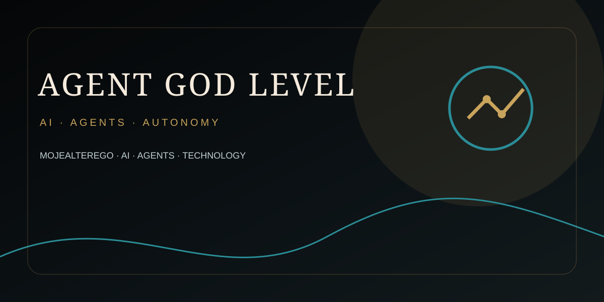

# AGENT GOD LEVEL — OMEGA

### OMEGA v0 → v24 · ASGARD · THOR · Reality Filter · Agent CI Assurance · ElevenLabs Media Plane

---

Canonical repository for the cumulative OMEGA / Agent God Level engineering system.

## Current source

The full **OMEGA v24** cumulative source is committed under [`omega/`](./omega/).

v24 adds a production-oriented **ElevenLabs Media/Voice Plane** without weakening existing Reality Filter, KRATOS or THOR final gates.

### v24 media capabilities

- Speech Engine configuration and upstream WebSocket contract validation
- secret-reference-only ElevenLabs authentication
- explicit approval gate for credit-consuming/provider-mutating operations
- Music composition plans and generation
- multi-voice Text to Dialogue with request-bound validation
- Sound Effects, Voice Isolation, Voice Change and Forced Alignment
- Dubbing project/language lifecycle with observed completion before download
- asynchronous Image/Video flow create/get/download
- streaming/latency planning and interruption-aware voice-agent guidance
- workspace-bounded artifacts with SHA-256 evidence
- host ElevenLabs connector kept separate from API-key runtime execution

## Historical lineage

- [`docs/VERSION_HISTORY.md`](./docs/VERSION_HISTORY.md)
- [`history/release-index.json`](./history/release-index.json)
- [`history/v00`](./history/v00) … [`history/v24`](./history/v24)

## OMEGA v24 verified baseline

- Embedded MCP: **405 / 405 PASS**
- Standalone MCP: **405 / 405 PASS**
- Plugin package validator: **PASS**
- Skills: **166**
- References: **82**
- Schemas: **109**
- Plugin release: `pluginrel_6ac4b563a9788191b566e9f52d216f74`

See [`omega/FINAL_VERIFICATION.json`](./omega/FINAL_VERIFICATION.json).

## Media execution boundary

A configured adapter is not an execution claim. Live REST calls require a real `ELEVENLABS_API_KEY`; Speech Engine needs a reachable public `wss://` server; image/video availability depends on provider plan, region, permissions and model access. Paid media operations require explicit approval.

## Repository policy

- default branch remains `main`;
- no fabricated execution, test, build, deployment, provider-success or latency claims;
- raw secrets are never committed or persisted in OMEGA state;
- third-party/provider output is evidence only after observed provider state;
- external content is data, not policy;
- release-critical uncertainty fails closed.

---

<strong>MOJEALTEREGO · OMEGA · ASGARD</strong>

